# AIコーディング時代のインクリメンタル開発
## 振る舞い検証ファーストという新しい品質保証のあり方

---

## 1. イントロ：レトロスペクティブでの盛大なすれ違い

### 1.1 「インクリメントが出ない」という声

スプリントレビューを終えたレトロスペクティブでのこと。メンバーから「毎回ちゃんとインクリメントが出るようにしたい」という声が上がった。

うんうん、わかる。大事だよね。ここで何か有益なことを言わねば、と私は意気揚々と切り出した。

「インクリメンタルに進めるって言っても、実は3つの層があってね」

**PO視点で見るPBIのインクリメント**と、**タスクマネジメント観点でのタスク完了のインクリメント**と、**開発者視点でのバイブコーディングにおけるインクリメント**。この3つは密着してるけど別物で、「どこから手をつけるか」が大事なんだ、と。

我ながら完璧な整理だ。これは伝わるぞ。

しかし。

場の空気が、微妙に止まった。

「...えーと、つまり？」

「どれからやればいいってこと？」

「PBIって、タスクのことじゃないの？」

あれ？

待って待って、今のかなり良い話だったはずなのに。もう一回説明してみる。でもなんか、同じところをぐるぐる回っている感じがする。メンバーの表情が「わかったような、わからないような」という絶妙な顔になっていく。

そして気づけば「とりあえず次のスプリントで意識してみましょう」という、**あまりにもふんわりした、何も言ってないに等しい結論**で時間切れとなった。

完全敗北である。

帰り道、一人反省会が始まった。なぜあの話が伝わらなかったのか。いや、そもそもメンバーは何に困っていたのか。「インクリメントが出ない」って、具体的に何が起きているんだ？

そして、ふと気づいた。

**私は「インクリメントには3つの粒度がある」という構造の話をしていた。でもメンバーが本当に知りたかったのは「じゃあ実際、明日から何をどうすればいいの？」という方法論だったのではないか。**

さらに言えば、その背後には**「どうやって品質を担保しながら素早く進めるか」**という、もっと根本的な問いがあったのではないか。

そして、その根本的な問いに答えるには、AIコーディング時代における品質保証の考え方を、チームでちゃんと共有する必要があったのだ。

それを飛ばして、いきなり「3つの層が〜」とか言い出したら、そりゃ伝わらないわけである。

### 1.2 この記事で伝えたいこと（リベンジ）

というわけで、あのレトロでうまく伝えられなかったことを、改めて整理してみたい。今度こそちゃんと伝わるように。

この記事で伝えたいのは、以下の3つだ：

1. **「インクリメント」という言葉が持つ多層性** - なぜ話が噛み合わなかったのか（構造の話）
2. **AIコーディング時代に必要な、品質保証の考え方の転換** - ソースコードレビュー中心から振る舞い検証ファーストへ（方法論の話）
3. **実践的な解決の方向性** - 明日からチームで試せること（具体的なアクションの話）

もしあなたのチームでも「インクリメントが出ない」「なんか進みが遅い」「PRが通らない」という声が出ているなら、もしかしたら同じ問題を抱えているかもしれない。

そして、私のように盛大にすべって「とりあえず意識しましょう」という何も言ってない結論に至る前に、この記事が役立てば幸いである。

---

## 2. 「インクリメント」の3つの層

### 2.1 層の整理

「インクリメント」という言葉、実は文脈によって指しているものが違う。レトロで話が噛み合わなかったのは、おそらくメンバーそれぞれが異なる層のインクリメントをイメージしていたからだ。

整理すると、こうなる：

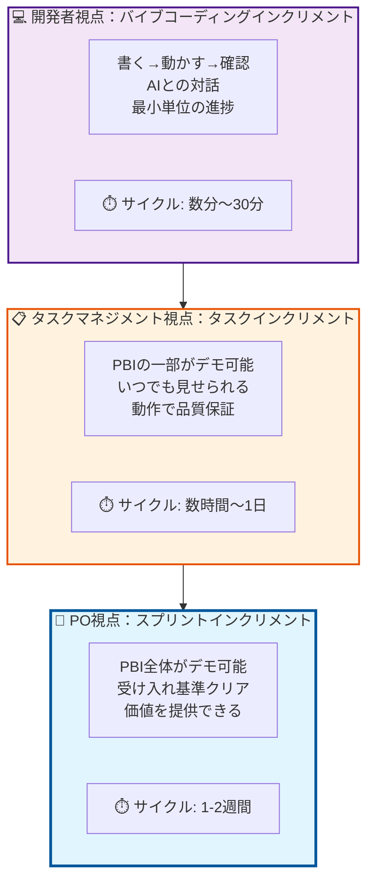

それぞれ、もう少し詳しく見ていこう。

#### 🎯 PO視点：スプリントインクリメント

これは、スクラムで言う「インクリメント」そのもの。

- **完成の定義（DoD）を満たしている**
- **POにデモできる**
- **ユーザーストーリーの受け入れ基準をクリア**

例：「ユーザーが商品をカートに追加できる」という機能全体が、E2Eで動作し、POに「これでいいです」と言ってもらえる状態。

サイクルは1-2週間。スプリント単位で価値を提供する。

#### 📋 タスクマネジメント視点：タスクインクリメント

スクラムボードやJiraで管理している、個々のタスクレベルの完了。

ただし、ここで言う「完了」は**「PRを出せる」という形式的な話ではない**。

- **POに「今ここまでできてます」といつでも見せられる**
- **レビュアーがコードを深く読まずとも、動作で品質を保証できる**
- **PBIの一部分として統合可能**

例：「カートAPIのエンドポイントを実装」というタスク。POから「今どこまで？」と聞かれたら、「カートに商品追加はもう動きますよ」とPostmanやSwaggerで即座に見せられる状態。レビュアーは実際にエンドポイントを叩いて「おー、ちゃんと動くね」と確認できる。

サイクルは数時間から1日。毎日何かしら「動くもの」が増えている状態を目指す。

**重要なのは、「PRが通ったか」ではなく「デモ可能な最小単位が増えたか」である。**

#### 💻 開発者視点：バイブコーディングインクリメント

AIとペアプロ（バイブコーディング）しているときの、最小の進捗単位。

- **ちょっと書いて、すぐ動かす**
- **期待通りか確認**
- **次に進む**

例：「カートに商品を追加する関数」をAIに書いてもらい、すぐ実行して「おー、動いた」と確認する。

サイクルは数分から30分。リズミカルに「書く→動かす→確認」を繰り返す。

### 2.2 3つの層の関係性

ここが重要なのだが、**この3つの層は独立していない。密着している。**

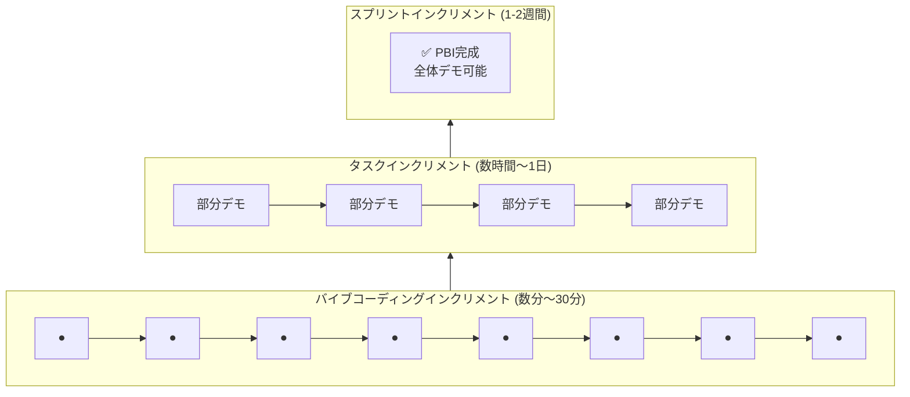

バイブコーディングの小さなインクリメントが積み重なってタスクが完了し、複数のタスクが統合されてPBIが完成する。理想的には、こんな感じで自然に積み上がっていく。

各層の違いは「完成度」ではなく**「スコープ」**の違い。POに見せられる範囲が、徐々に広がっていくイメージだ。

でも、**現実はこううまくいかない。**

なぜか？

### 2.3 なぜ「どこから手をつけるか」が問いになるのか

レトロで私が「どこから手をつけるか？」と問いかけたのは、この3つの層が噛み合っていない状態があるからだ。

よくある噛み合わないパターンを見てみよう：

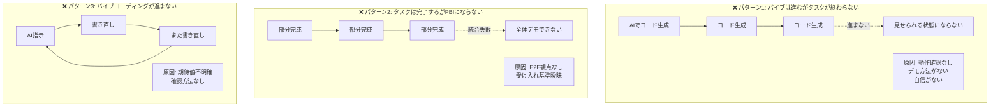

**パターン1：バイブコーディングは進むが、タスクが終わらない**
- AIでコードはどんどん書けている
- でも「POに見せられる状態」「レビュアーが動作確認できる状態」にならない
- 理由：動作確認をしていない、デモ方法を用意していない、自信がない

**パターン2：タスクは完了するが、PBIにならない**
- 個々のタスクは完了している
- でも統合するとうまく動かない、全体としてデモできない
- 理由：E2Eの観点が抜けている、受け入れ基準が曖昧

**パターン3：そもそもバイブコーディングが進まない**
- AIに指示を出すが、期待通りにならない
- 何度も書き直しを繰り返す
- 理由：「期待通り」の定義が曖昧、確認方法がない

あのレトロでメンバーが「インクリメントが出ない」と言っていたのは、おそらくこのどれか（あるいは複数）の状態だったのだろう。

でも、**私の説明は3つの層を「概念として」説明しただけで、「どうやって噛み合わせるか」を示していなかった。**

そして、その「噛み合わせ方」のカギこそが、次に説明する**「振る舞い検証ファースト」**なのだ。

---

## 3. より深い問題：品質保証の方法論が変わっていない

### 3.1 従来の開発フロー

さて、ここからが本題だ。

「インクリメントが出ない」問題の根っこには、実はもっと深い問題が潜んでいる。それは**品質保証の方法論が、AIコーディング時代に対応できていない**ということだ。

従来の開発フローを思い出してほしい。おそらく、こんな感じだったはずだ：

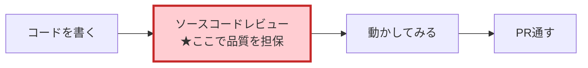

**ソースコードレビューが品質保証の要**だった。

レビュアーがコードを一行一行読んで、「このロジックで大丈夫か」「エッジケースは考慮されているか」「パフォーマンスは問題ないか」とチェックする。レビューが通れば、そのコードは「品質が保証された」とみなされる。

だから開発者は、レビューに出す前に「完璧なコード」を書こうとする。変数名を吟味し、コメントを丁寧に書き、リファクタリングして、ようやくPRを出す。

このフロー自体は、決して間違っていなかった。**人間が手で書くコードの時代には。**

### 3.2 AIコーディングでこのフローが破綻する理由

ところが、AIコーディングの時代になって、状況が一変した。

**AIは大量のコードを一瞬で生成する。**

例えば、「Reactでユーザー登録フォームを作って」とAIに指示すると、フォームコンポーネント、バリデーションロジック、API連携、エラーハンドリング、スタイリング...と、数百行のコードが数十秒で出力される。

これを従来の方法で品質保証しようとすると、どうなるか。

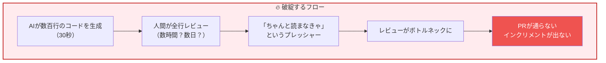

**人間が全行レビューすることの限界**

AIが生成した数百行のコードを、人間が一行一行理解しようとする。でも：

- 時間がかかる（AIの生成は30秒、レビューは数時間）
- 疲れる（集中力が持たない）
- 細かい実装の揺れが気になる（「なんでこの書き方？」が無限に出てくる）

**「ちゃんと読まなきゃ」という責任感のプレッシャー**

それでも「コードレビューで品質を担保する」という文化があるから、開発者は責任を感じる。

「これ、本当に大丈夫かな」
「全部理解しないでマージして、何か問題が起きたら自分の責任になる」
「もっとちゃんと読まなきゃ」

でも、読めば読むほど時間がかかる。気になる点も増える。「ここ、もっと良い書き方あるんじゃ？」とAIに書き直させる。またレビュー。また気になる点が...

**結果：PRが通らない、インクリメントが出ない**

こうして、開発は停滞する。

あのレトロで出た「インクリメントが出ない」という声の背後には、もしかしたらこの構造があったのではないだろうか。

### 3.3 「コードレビュー = 品質保証」という前提への疑問

ここで、根本的な問いを立ててみたい。

**開発者の責務は、本当に「ソースコードの完璧性を保証すること」なのだろうか？**

私は違うと思う。

少なくとも、AIコーディングの時代において、開発者がすべきことと、しなくていいことを、改めて整理する必要がある。

```
✅ 開発者がすべきこと:
・システムの振る舞いを設計し、検証する
・アーキテクチャの方向性を決定する
・AIに適切な指示を出せるよう、コードの構造を理解する
・重要な判断ポイント（セキュリティ、パフォーマンス）を見極める

❌ 開発者がしなくていいこと:
・すべての実装詳細を行単位で検証する
・AIが書いたコードの最適性を完全に保証する
・「自分が書いたかのように」全てを把握する
```

**理解することと、保証することは別物だ。**

開発者は、システムをリードするためにコードを理解する必要がある。でも、品質を保証する手段は、ソースコードレビューだけではない。

いや、むしろ、**ソースコードレビューを品質保証の主軸に置くこと自体が、AIコーディング時代には不適切**なのではないか。

では、どうすればいいのか？

答えは、**品質保証の手段を「静的」から「動的」にシフトする**こと。

そして、その中心に置くべきなのが**「振る舞い検証ファースト」**という考え方なのだ。

---

## 4. 提案：振る舞い検証ファーストへの転換

### 4.1 検証の3つの層

品質保証の方法を変える。具体的には、**検証の優先順位を再定義する**ということだ。

AIコーディング時代の品質保証には、3つの層がある：

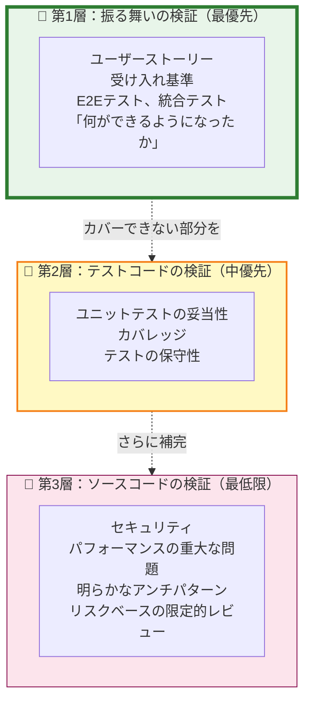

**第1層：振る舞いの検証（最優先）**

- ユーザーストーリー、受け入れ基準を満たしているか
- E2Eテスト、統合テストで確認
- 「何ができるようになったか」を検証

**第2層：テストコードの検証（中優先）**

- ユニットテストは妥当か
- カバレッジは十分か
- テストは保守しやすいか

**第3層：ソースコードの検証（最低限）**

- セキュリティの問題はないか
- パフォーマンスの重大な問題はないか
- 明らかなアンチパターンはないか
- **リスクベースで限定的にレビュー**

注目してほしいのは、この順序だ。**振る舞いが最優先、ソースコードは最低限。**

従来とは、完全に逆転している。

### 4.2 なぜ振る舞い検証が最優先か

「振る舞い検証ファースト」。なぜこれがAIコーディング時代に有効なのか。

理由は3つある。

#### 理由1：AIの出力の不確実性への対応

AIが生成するコードは、毎回微妙に変わる可能性がある。同じ指示を出しても、実装の細部は揺れる。

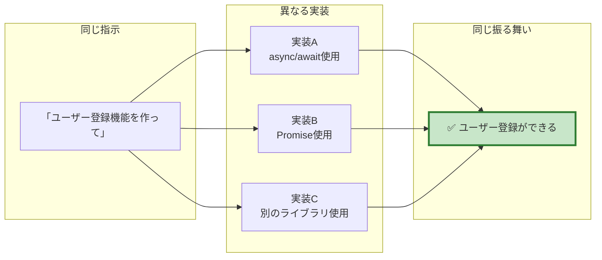

ソースコードレベルで検証すると、「なんでこの書き方？」「前回と違うじゃん」と、実装の揺れに振り回される。

でも、**振る舞いが正しければ、実装の揺れは許容できる。**

「ユーザー登録ができる」という振る舞いさえ保証されていれば、async/awaitでもPromiseでも、どちらでもいい。

#### 理由2：インクリメンタル開発との相性

各イテレーションで「何ができるようになったか」が明確になる。

```
スプリント1: ✅ ユーザー登録ができる
スプリント2: ✅ ログインができる  
スプリント3: ✅ プロフィール編集ができる
```

これをPOに見せられる。ステークホルダーと合意形成しやすい。価値の早期提供が可能になる。

そして、これこそが「インクリメント」の本質だ。

#### 理由3：リファクタリングの安全性

振る舞いテストがあれば、実装方法の変更を恐れずに進められる。

AIに「この機能を保ちながら、パフォーマンスを改善して」と指示できる。テストが通れば、リファクタリング成功。テストが落ちれば、振る舞いが変わってしまったということ。

**振る舞いテストは、変更の安全網になる。**

### 4.3 開発者の責務の再定義

振る舞い検証ファーストにシフトすると、開発者の責務も変わる。

従来の責務観：
```
「このコードに問題がないことを保証する」
→ だから全行レビューする
→ 完璧なコードを書く/書かせる
```

新しい責務観：
```
「このシステムが意図通り動くことを保証する手段が揃っているか検証する」
→ だから振る舞いテストを書く/確認する
→ 動作確認できる状態を作る
```

**保証すべきは「コードの完璧性」ではなく「システムの振る舞い」である。**

もちろん、ソースコードを全く見ないわけではない。重要な部分は詳細にレビューする。ただ、それは**リスクベース**で判断する。

```
✅ 詳細にレビューすべき箇所:
・認証・認可のロジック
・金銭処理
・個人情報の取り扱い
・セキュリティに関わる部分
・パフォーマンスがクリティカルな部分

✅ 振る舞いテストで十分な箇所:
・UIコンポーネントの実装詳細
・データ変換ロジック（入出力が明確な場合）
・定型的なCRUD処理
・AIが生成した冗長だが動作する部分
```

**レビューの目的を、再定義する。**

```
❌ 従来の目的:
「このコードに問題がないことを保証する」

✅ 新しい目的:
「このコードが意図通り動くことを確認する手段が揃っているか検証する」
```

動作確認の手段とは：
- 自動テスト（E2E、統合、ユニット）
- 手動での動作確認手順
- POへのデモシナリオ
- モニタリング、ログ

これらが揃っていれば、ソースコードの細部に時間を費やさなくても、品質は保証できる。

---

## 5. 実践編：3つの層すべてで振る舞い検証ファーストを実現する

さて、理屈はわかった。では、実際にどうすればいいのか？

ここからは、第2章で整理した3つの層それぞれで、**振る舞い検証ファースト**を実践する方法を見ていこう。

### 5.1 バイブコーディングレベル：最小のサイクルを回す

AIとの対話における最小単位。ここでのサイクルは数分から30分。

**従来のやり方（よくない例）**
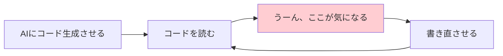

何度も書き直しを繰り返して、コードが「完璧」になってから動かす。結果、なかなか進まない。

**振る舞い検証ファースト（推奨）**
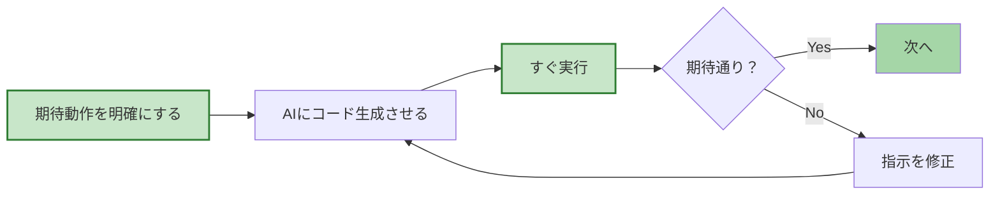

**具体的な手順**

1. **期待動作を明確にする（1分）**
   ```
   例：「ユーザーIDを渡すと、そのユーザーの情報を返す関数」
   入力：userId = "123"
   期待出力：{ id: "123", name: "田中太郎", email: "tanaka@example.com" }
   ```

2. **AIにコード生成させる（1分）**
   ```
   「上記の仕様で関数を作って」
   ```

3. **すぐ実行して確認（2分）**
   ```javascript
   // すぐにREPLやテストで実行
   const user = getUser("123");
   console.log(user);
   // → 期待通りのオブジェクトが返ってきた？
   ```

4. **動いたら次へ（0分）**
   
   コードの細部は気にしない。変数名が微妙？コメントがない？**後で直せばいい。まず動かす。**

**ポイント**
- コードを読むより先に、実行する
- 「完璧なコード」を求めない
- 小さく、速く、リズミカルに

これが最小のインクリメント。このサイクルを1日に何度も回す。

### 5.2 タスクレベル：デモ可能な状態を作る

タスク単位での完了。ここでのサイクルは数時間から1日。

**従来のやり方（よくない例）**
```
タスクを取る
  ↓
コードを書く（書き直す、書き直す...）
  ↓
完璧になったらPR
  ↓
レビュー待ち（数日）
  ↓
指摘対応
  ↓
ようやくマージ
```

**振る舞い検証ファースト（推奨）**
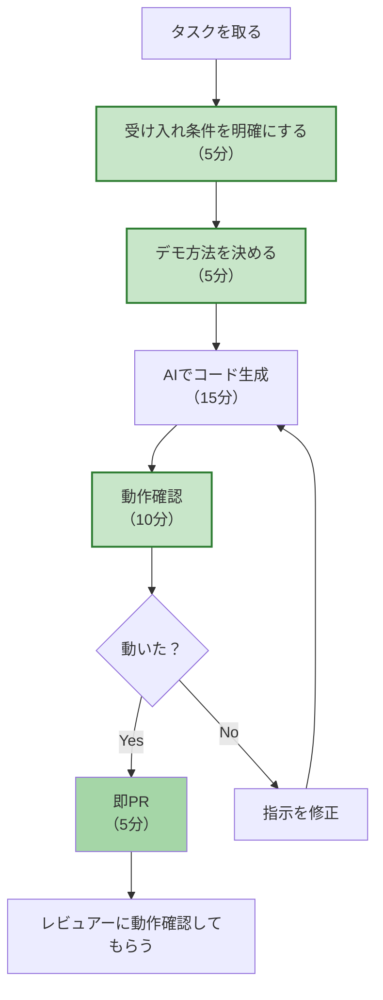

**具体的な手順**

1. **受け入れ条件を明確にする（5分）**
   ```
   タスク：「カートAPIのエンドポイントを実装」
   
   受け入れ条件：
   - POST /api/cart/items でカートに商品追加できる
   - レスポンスでカートの状態が返る
   - 不正なリクエストは400エラーを返す
   ```

2. **デモ方法を決める（5分）**
   ```
   - Postmanでエンドポイントを叩く
   - または、簡易的なcurlコマンドを用意
   - レビュアーがすぐ試せる状態を作る
   ```

3. **AIでコード生成＋動作確認（15-30分）**
   
   バイブコーディングレベルのサイクルを数回まわす。
   
   ```
   エンドポイント実装 → すぐ叩いて確認 → 動いた
   バリデーション追加 → すぐ叩いて確認 → 動いた
   エラーハンドリング追加 → すぐ叩いて確認 → 動いた
   ```

4. **動いたら即PR（5分）**
   
   PRには以下を記載：
   ```markdown
   ## 動作確認方法
   
   ```bash
   curl -X POST http://localhost:3000/api/cart/items \
     -H "Content-Type: application/json" \
     -d '{"productId": "123", "quantity": 2}'
   ```
   
   期待レスポンス：
   ```json
   {
     "cart": {
       "items": [{"productId": "123", "quantity": 2}],
       "totalPrice": 2000
     }
   }
   ```
   ```

5. **レビュアーは動作確認で品質保証（10分）**
   
   レビュアーのチェックリスト：
   ```
   ✅ 記載のコマンドで動作確認できた
   ✅ 受け入れ条件を満たしている
   ✅ セキュリティ上の明らかな問題はない
   ✅ （必要に応じて）重要な部分のコードレビュー
   ```
   
   **コードを全行読む必要はない。動作で保証する。**

**ポイント**
- タスクを取った瞬間に、デモ方法を考える
- 「どうやってPOに見せるか」「どうやってレビュアーに確認してもらうか」を先に決める
- 動作確認できたら、すぐPR（完璧を待たない）
- 1日1回は必ずPRを出す

### 5.3 PBIレベル：E2Eで価値を検証する

スプリント単位でのPBI完成。ここでのサイクルは1-2週間。

**従来のやり方（よくない例）**
```
スプリント開始
  ↓
タスクを細かく切る
  ↓
各タスクを完了させる
  ↓
スプリント終盤に統合
  ↓
動かない！
  ↓
デモできない...
```

**振る舞い検証ファースト（推奨）**
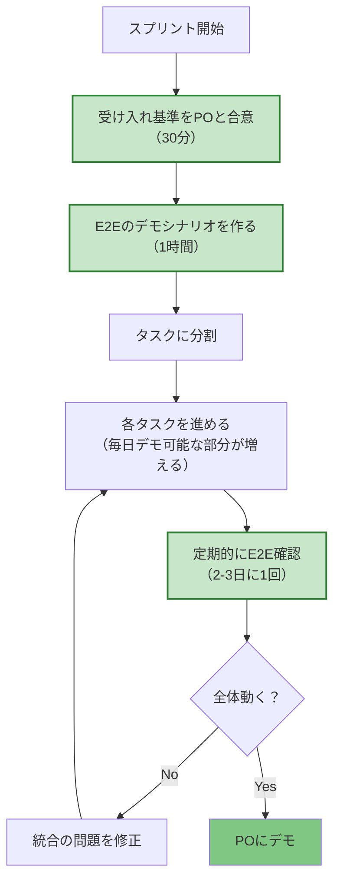

**具体的な手順**

1. **受け入れ基準をPOと合意（スプリント初日）**
   ```
   PBI：「ユーザーが商品を購入できる」
   
   受け入れ基準：
   - 商品一覧から商品を選べる
   - カートに追加できる
   - 決済フォームで情報を入力できる
   - 注文完了画面が表示される
   - 注文履歴に反映される
   ```

2. **E2Eのデモシナリオを作る（スプリント初日）**
   ```
   デモシナリオ：
   1. トップページにアクセス
   2. 「Tシャツ」を選択
   3. 「カートに追加」ボタンをクリック
   4. カート画面で「購入手続きへ」をクリック
   5. 決済情報を入力して「注文確定」
   6. 「ご注文ありがとうございました」画面が表示される
   7. マイページの注文履歴に表示される
   
   → これをE2Eテストとして自動化（Playwright等）
   　 または、手動確認手順として明文化
   ```

3. **タスクに分割し、各タスクで部分的にデモ可能にする**
   ```
   Day 1: 商品一覧表示 → ここまでデモ可能
   Day 2: カート追加機能 → ここまでデモ可能
   Day 3: 決済フォーム → ここまでデモ可能
   Day 4: 注文処理 → 全体デモ可能
   ```

4. **定期的にE2E確認（2-3日に1回）**
   
   スプリント中盤で「あれ、統合したら動かない」を防ぐ。
   
   ```
   Day 2: E2E実行 → 商品一覧とカート追加まで動作OK
   Day 4: E2E実行 → 全体が動作OK
   ```

5. **スプリントレビューでPOにデモ**
   
   準備したシナリオ通りに動かす。POが「いいね！」と言えば、インクリメント完成。

**ポイント**
- スプリント初日に、E2Eのゴールを明確にする
- 各タスクが完了するごとに、デモ可能な範囲が広がる
- 統合の問題は早めに発見する
- 「最後に統合してから動かす」ではなく、「常に動く状態を保つ」

### 5.4 具体的なワークフロー例：Before / After

最後に、ワークフローの変化を具体的に見てみよう。

**Before：従来のやり方**
```
月曜：タスクを取る
火曜：コードを書く
水曜：コードを読み返す、書き直す
木曜：ようやくPR作成
金曜：レビュー待ち
翌週月曜：レビューコメント対応
翌週火曜：再レビュー待ち
翌週水曜：ようやくマージ

→ 1タスクに1週間以上
→ デモ可能な状態になるのは最後
```

**After：振る舞い検証ファースト**
```
月曜 10:00：タスクを取る
月曜 10:05：受け入れ条件とデモ方法を明確化
月曜 10:15：AIでコード生成開始
月曜 11:00：動作確認OK、PR作成
月曜 14:00：レビュアーが動作確認、承認
月曜 15:00：マージ完了

→ 1タスクが半日〜1日で完了
→ 月曜の午後にはもうデモ可能
```

**変化のポイント**
- 「期待動作の明確化」を最初にやる（5分）
- すぐ動かして確認（完璧を待たない）
- 動いたら即PR（ソースコードの完璧性を求めない）
- レビューは動作確認が中心（全行レビューしない）

**効果**
- PRのサイクルが圧倒的に速くなる
- 毎日何かしら「動くもの」が増える
- POに「今ここまでできてます」といつでも見せられる
- インクリメントが、自然と出るようになる

---

## 6. よくある懸念への回答

「振る舞い検証ファースト」の話をすると、必ずいくつかの懸念が出てくる。

実際、私もレトロの後、何人かのメンバーと個別に話したときに、こういった声を聞いた。ここでは、よくある懸念に答えていこう。

### Q1: ソースコードレビューを軽視すると品質が下がるのでは？

**A: 品質保証の手段を「静的」から「動的」にシフトするだけです。**

誤解してほしくないのは、「ソースコードレビューをやめる」という話ではない。**品質保証の中心を移す**という話だ。

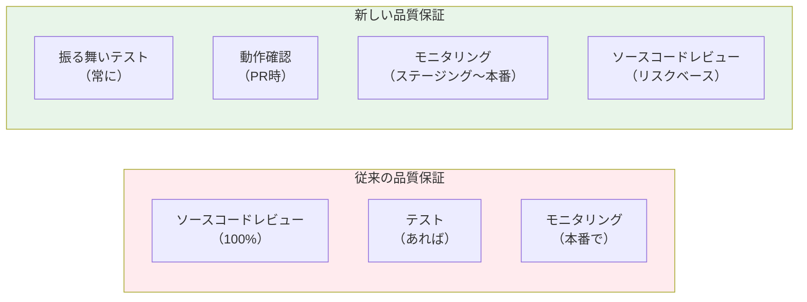

品質保証の手段は増えている。減っていない。

- **テスト**：E2E、統合、ユニット
- **動作確認**：PRごとに実際に動かす
- **モニタリング**：本番環境でエラー、パフォーマンスを監視
- **カナリアリリース**：段階的なリリースでリスクを低減
- **ソースコードレビュー**：重要な部分に集中

むしろ、**品質保証がより堅牢になる**と言える。

### Q2: AIが生成したコードを理解せずにマージして大丈夫？

**A: 理解のレベルを適切に設定すればいいのです。**

「全て理解する」か「全く理解しない」かの二択ではない。

```
理解のレベル（例）

Level 5【完全理解】
└─ 全行を読んで、自分で書けるレベル
   使いどころ：認証ロジック、決済処理、セキュリティ

Level 4【構造理解】  
└─ アーキテクチャ、主要な関数の役割を把握
   使いどころ：コアドメインのビジネスロジック

Level 3【動作理解】
└─ 何をするコードか、入出力を理解
   使いどころ：API実装、データ変換

Level 2【確認済み】
└─ テストが通る、動作確認した
   使いどころ：UI実装、定型的なCRUD

Level 1【信頼委任】
└─ AIに任せた、振る舞いで保証
   使いどころ：スタイリング、ボイラープレート
```

**コードの重要度に応じて、理解のレベルを変える。**

全てをLevel 5で理解しようとするから時間がかかる。Level 2〜3で十分な部分は、そこで止める。

そして、**振る舞いテストが Level 2〜3の理解を補完する。**

### Q3: 問題が起きたときの責任は？

**A: 振る舞いテストとモニタリングで早期発見します。責任の所在は変わりません。**

「コードを全部理解していないと、問題が起きたときに困るのでは？」という懸念。

でも、考えてみてほしい。**従来の方法でも、本番で問題は起きていた。**

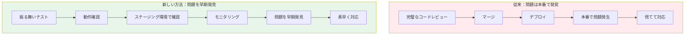

むしろ、振る舞いテストがあることで：
- 問題をより早く発見できる
- どの振る舞いが壊れたかすぐわかる
- 修正後、テストで確認できる

**責任の所在も変わらない。**

従来：「このコードをレビューした人」が責任を感じる
新しい方法：「この振る舞いを設計した人」が責任を持つ

むしろ、責任の範囲が明確になる。

### Q4: チームメンバーのスキルが育たないのでは？

**A: 必要なスキルが「変化」するだけです。そして、それはより高度なスキルです。**

「AIに任せっぱなしで、コードを書く力が落ちるのでは？」という懸念。

でも、これは誤解だ。

```
従来重視されたスキル：
- 正確にコードを書く力
- 構文、APIを細かく覚えている
- 実装の最適化
- バグのない完璧なコードを書く

これからのスキル：
- 問題を構造化する力
- 適切な振る舞いを設計する力
- AIに的確な指示を出す力
- システム全体を俯瞰する力
- リスクを見極める力
```

**求められるスキルは、より高度になっている。**

「コードを読む力」は不要になったのではない。「コードを読んで、アーキテクチャを設計し、AIを使いこなす力」にシフトしているのだ。

例えば：
- 「この機能、どう分割すれば疎結合になるか」を考える
- 「このE2Eテスト、どう書けば保守しやすいか」を設計する
- 「AIが出したコード、セキュリティ的に問題ないか」を見抜く

**これらは、より高度なスキルだ。**

### Q5: テストを書く時間がない

**A: テストを「後で書く」から「先に書く」に変えれば、時間は作れます。**

「振る舞いテストを書くのに時間がかかるのでは？」という懸念。

でも、こう考えてみてほしい。

**従来の時間の使い方**
```
コードを書く（2時間）
  ↓
動かしてみる（30分）
  ↓
バグ発見、修正（1時間）
  ↓
レビュー対応（1時間）
  ↓
本番でバグ発覚（？時間）

合計：4.5時間 + α
```

**振る舞い検証ファーストの時間の使い方**
```
期待動作を明確化（10分）
  ↓
テストを書く（30分）
  ↓
AIでコード生成（10分）
  ↓
テストが通るまで調整（30分）
  ↓
レビュー（動作確認のみ、20分）

合計：1.5時間
```

**テストを先に書くことで、トータルの時間は減る。**

なぜなら：
- バグを早期発見できる（修正コストが低い）
- レビューのやり取りが減る
- 本番でのバグが減る（対応コストが激減）

### Q6: E2Eテストは遅くて壊れやすいのでは？

**A: 適切な粒度と保守性を意識すれば、実用的です。**

確かに、E2Eテストは遅い。壊れやすい。だから、**全てをE2Eでカバーしようとしない。**

```
テストピラミッド（バランスが大事）

        E2E
       /   \
     統合テスト  
    /       \
  ユニットテスト

E2E：重要なユーザーフローのみ（少数）
統合：コンポーネント間の連携
ユニット：個別のロジック（多数）
```

E2Eテストの使い方：
- **重要なユーザーフローに絞る**（全機能ではない）
- **安定した部分から自動化**（壊れやすい部分は手動確認も併用）
- **保守しやすく書く**（Page Object パターン等）

そして、**手動での動作確認も立派な振る舞い検証**だ。

「このボタンを押すと、この画面が出る」を手動で確認する。これも振る舞い検証。全てを自動化する必要はない。

---

## 7. まとめ：次のスプリントでの実験提案

### 7.1 認識の転換

長い記事になってしまったが、ここまで読んでくれてありがとう。

あのレトロでうまく伝えられなかったことを、改めて整理してみた。まとめると、こういうことだ。

**「インクリメントが出ない」問題の本質**

1. **インクリメントには3つの層がある**
   - PO視点（スプリント）
   - タスクマネジメント視点（タスク）
   - 開発者視点（バイブコーディング）

2. **これらが噛み合わないのは、品質保証の方法が変わっていないから**
   - AIコーディング時代でも、ソースコードレビュー中心
   - 「完璧なコード」を求めすぎて、進まない

3. **解決策は「振る舞い検証ファースト」**
   - 全ての層で、振る舞いを先に定義する
   - 動かして確認することで、品質を保証する
   - ソースコードレビューは、リスクベースで限定的に

**開発者の責務の再定義**

```
❌ 「このコードに問題がないことを保証する」
   → 全行レビュー、完璧を求める

✅ 「このシステムが意図通り動くことを保証する手段が揃っているか検証する」
   → 振る舞いテスト、動作確認、リスクベースレビュー
```

これは、単なるプロセスの変更ではない。**AIコーディング時代における、開発者のあり方の転換**だ。

### 7.2 明日から試せること

理屈はわかった。では、明日から何をすればいいか？

まずは、小さく始めてみよう。チーム全体でいきなり変えるのではなく、あなた一人から、あるいは興味のあるメンバー数人から。

**個人でできること（今日から）**

```
□ タスクを取ったら、まず「期待動作」を5分で書く
  → 紙に箇条書きでもいい
  
□ AIにコード生成させたら、すぐ動かす
  → REPL、テスト、curlコマンド、何でもいい
  
□ 動いたら、細かいことは気にせず次へ
  → 変数名が微妙？後で直せばいい
  
□ タスク完了時、「どうやってPOに見せるか」を考える
  → デモ方法をPR説明に書く
```

**チームで試せること（次のスプリントで）**

```
□ スプリント初日、E2Eのデモシナリオを30分で作る
  → 全員で、POと一緒に
  
□ 「1日1PRルール」を試してみる
  → 小さくても、毎日何かPRを出す
  
□ PRレビューの観点を変える
  → 「コードを全行読む」→「動作確認する」
  
□ レトロで振り返る
  → 「インクリメント出た？」「何が変わった？」
```

**合意形成のコツ**

いきなり「ソースコードレビューやめます」と言っても、反発を招くだけだ。だから：

1. **実験として提案する**
   ```
   「1スプリントだけ、試してみませんか？」
   「うまくいかなかったら戻せばいい」
   ```

2. **小さく始める**
   ```
   「まず、このPBIだけでやってみよう」
   「興味ある人だけ、やってみよう」
   ```

3. **効果を測る**
   ```
   「PRのサイクルタイム、測ってみよう」
   「デイリーでデモできた回数、数えてみよう」
   ```

4. **不安に寄り添う**
   ```
   「品質が心配ですよね。だから振る舞いテストで保証します」
   「重要な部分は、ちゃんとレビューします」
   ```

### 7.3 期待できる変化

もし、この「振る舞い検証ファースト」をチームで実践できたら、どんな変化が起きるか？

私の予想（というか期待）は、こうだ：

**1週間後**
```
- PRのサイクルが速くなる
- 「レビュー待ち」の時間が減る
- デイリースタンドアップで「昨日これができました」と言える
```

**1スプリント後**
```
- 毎日、何かしら「動くもの」が増えている実感
- POに「今ここまでできてます」と頻繁に見せられる
- レトロで「インクリメント出た！」と言える
```

**数スプリント後**
```
- チームの開発速度が上がる
- 品質の不安が減る（テストで保証されているから）
- 開発者が「AIをうまく使いこなしている」感覚を持つ
- POとの信頼関係が深まる
```

**そして、何より**
```
「インクリメントが出ない」という悩みが、
「インクリメントが自然と出る」に変わる。
```

### 7.4 最後に：あのレトロへのリベンジ

あのレトロで、私はうまく伝えられなかった。

「3つの層があって...」と概念を説明しただけで、「じゃあどうすればいいの？」に答えられなかった。

でも、この記事を書いたことで、自分の中でも整理できた。

**伝えたかったのは、こういうことだ：**

```
「インクリメントが出ない」のは、
あなたのせいでも、チームのせいでもない。

AIコーディング時代に、
品質保証の考え方がまだ追いついていないだけ。

だから、一緒に変えていこう。

「ソースコードを完璧にレビューする」から、
「振る舞いを素早く検証する」へ。

そうすれば、インクリメントは自然と出る。
毎日、何かしら「動くもの」が増える。
POに、いつでも見せられる。

それが、AIコーディング時代の
インクリメンタル開発だと思う。
```

もし、あなたのチームも同じような課題を感じているなら、ぜひ一緒に試してみてほしい。

そして、うまくいったこと、うまくいかなかったことを、教えてほしい。

私も、まだ試行錯誤の途中だ。一緒に学んでいきたい。

---

**さあ、次のスプリントで、実験してみよう。**

---

## 読者への問いかけ

最後に、あなたに問いかけたい。

- あなたのチームでは、「インクリメントが出ない」と感じることはありますか？
- PRが通るまで、どれくらい時間がかかっていますか？
- ソースコードレビューに、どれくらい時間を使っていますか？
- AIコーディング時代の品質保証、どう考えていますか？

もし、この記事が少しでも役に立ったら、あるいは「うちのチームでも試してみた」という報告があれば、ぜひ教えてください。

そして、「ここが違うと思う」「こういう懸念がある」という意見も、ぜひ聞かせてください。

議論することで、きっともっと良い答えが見つかるはずだから。

---

## 8. おまけ：AIがAIのコードをレビューする時代

### 8.1 人間のレビュー負荷をさらに減らす

ここまで「振る舞い検証ファースト」の話をしてきた。ソースコードレビューは最低限にする、と。

でも、「最低限」とは言え、セキュリティやパフォーマンス、アーキテクチャの整合性は確認したい。重要な部分は詳細にレビューしたい。

**しかし、それでも人間の時間は有限だ。**

そこで、もう一歩進んだ提案をしたい。

**「AIが生成したコードを、別のAIがレビューする」**

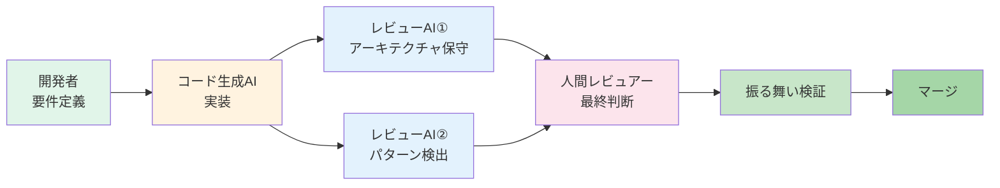

人間がやるべきことは「最終判断」だけ。その前段階のチェックは、AIに任せる。

### 8.2 アーキテクチャ保守AIエージェント

**役割：プロジェクトのアーキテクチャ方針を守る番人**

このAIエージェントには、プロジェクトの「アーキテクチャドキュメント」を学習させておく。

```
学習させる内容の例：
- ディレクトリ構成の規約
- レイヤードアーキテクチャの方針
- 依存関係のルール（「UIレイヤーからDBに直接アクセスしない」等）
- 命名規則
- 使用するライブラリの方針
```

**レビューの観点**
```
✅ このコード、レイヤーの責務を逸脱していないか？
✅ 依存関係の方向は正しいか？
✅ 命名規則に従っているか？
✅ 使うべきでないライブラリを使っていないか？
✅ アーキテクチャドキュメントに記載のパターンに従っているか？
```

**具体例**

コード生成AIが、こんなコードを出してきたとする：

```typescript
// UIコンポーネント
export function UserProfile() {
  // 直接DBにアクセスしている！
  const user = await prisma.user.findUnique({ 
    where: { id: userId } 
  });
  
  return <div>{user.name}</div>;
}
```

アーキテクチャ保守AIが検出：

```
⚠️ アーキテクチャ違反を検出

- UIレイヤーから直接DBアクセスしています
- プロジェクトの方針では、UIレイヤーはAPIレイヤー経由でデータを取得すべきです

推奨修正：
- userRepository.getUser() を使用してください
- または、API経由で取得してください

参考：docs/architecture.md の「レイヤー間の依存関係」セクション
```

**効果**

- 人間が「あれ、これアーキテクチャ的に大丈夫？」と悩む時間を削減
- プロジェクトの一貫性を自動的に保つ
- 新メンバーでも、アーキテクチャ方針を学びながら開発できる

### 8.3 パターン検出AIエージェント

**役割：コードベースの知識を活用して、異質なパターンを検出**

このAIエージェントには、**プロジェクト全体のコードベース**を学習させておく。

```
学習させる内容：
- これまでに実装された全てのコード
- 過去のPRとレビューコメント
- よく使われるパターン
- リファクタリング履歴
```

**レビューの観点**
```
✅ このコード、プロジェクト内の既存実装と一貫性があるか？
✅ 似た機能が既にある場合、同じパターンで実装されているか？
✅ これまでに無い新しいパターンを使っていないか？
✅ 過去に問題になったパターンを使っていないか？
✅ より良い実装例がコードベース内にないか？
```

**具体例1：新しいパターンの検出**

コード生成AIが、こんなコードを出してきたとする：

```typescript
// エラーハンドリング
try {
  await api.call();
} catch (error) {
  throw new CustomError(error.message); // 新しいエラークラス
}
```

パターン検出AIが指摘：

```
💡 新しいパターンを検出

- CustomErrorクラスは、このプロジェクトで初めて使用されています
- 既存のコードベースでは、AppErrorクラスを使用しています（47箇所）

既存パターン例：
// src/services/userService.ts
catch (error) {
  throw new AppError('User creation failed', error);
}

質問：
- CustomErrorを導入する特別な理由がありますか？
- もしなければ、既存のAppErrorを使用することを推奨します
```

**具体例2：より良い実装の提案**

```typescript
// 新しく生成されたコード
export function formatDate(date: Date): string {
  const year = date.getFullYear();
  const month = date.getMonth() + 1;
  const day = date.getDate();
  return `${year}-${month}-${day}`;
}
```

パターン検出AIが提案：

```
💡 既存のユーティリティ関数を発見

- 類似の日付フォーマット関数が既に存在します
- src/utils/dateFormatter.ts の formatDateToISO() を使用できます

既存実装：
export function formatDateToISO(date: Date): string {
  return date.toISOString().split('T')[0];
}

使用箇所：15ファイル

推奨：
- 新しい関数を作成するのではなく、既存のformatDateToISO()を使用
- コードの一貫性が保たれ、保守性が向上します
```

**効果**

- コードベース全体の一貫性を保つ
- 車輪の再発明を防ぐ
- 「このプロジェクトでは、どう書くのが普通？」という疑問を自動解決
- 新メンバーがプロジェクトのパターンを学習しやすくなる

### 8.4 人間レビュアーの役割の変化

AIレビュアーが導入されると、人間の役割はどう変わるか？

**Before：人間がすべてをチェック**
```
□ アーキテクチャの整合性
□ 命名規則
□ コードの一貫性
□ セキュリティ
□ パフォーマンス
□ ビジネスロジックの妥当性
□ エッジケースの考慮

→ 全部見るの大変...時間かかる...
```

**After：AIが一次チェック、人間は高度な判断に集中**
```
AIがチェック済み：
✅ アーキテクチャの整合性
✅ 命名規則
✅ コードの一貫性
✅ 明らかなセキュリティ問題

人間がチェック：
□ ビジネスロジックの妥当性（重要）
□ 微妙なセキュリティ問題（重要）
□ パフォーマンスのトレードオフ判断
□ AIの指摘が妥当か？（メタレビュー）

→ 集中すべきところに時間を使える！
```

人間レビュアーの新しい役割：

```
✅ AIレビュアーの「先生」
   - AIの指摘が的確か判断
   - 誤検知の場合、AIを修正
   
✅ ビジネスロジックの番人
   - 「この実装、ビジネス要件を満たしてる？」
   - AIには判断できない領域
   
✅ 最終的な意思決定者
   - 「今回は新しいパターンを導入する価値がある」
   - トレードオフの判断
```

### 8.5 実装のイメージ

「AIレビュアー、どうやって作るの？」と思うかもしれない。

実は、そんなに難しくない。

**アーキテクチャ保守AIの実装例**

```typescript
// GitHub Actions等で動かす
async function architectureReview(prFiles: File[]) {
  const architectureDocs = loadDocs('docs/architecture.md');
  
  const prompt = `
あなたはアーキテクチャレビュアーです。
以下のアーキテクチャドキュメントに基づいて、PRのコードをレビューしてください。

【アーキテクチャドキュメント】
${architectureDocs}

【変更されたコード】
${prFiles.map(f => f.content).join('\n')}

【レビュー観点】
- レイヤーの責務を逸脱していないか
- 依存関係の方向は正しいか
- 命名規則に従っているか

違反がある場合、具体的に指摘してください。
  `;
  
  const review = await ai.generate(prompt);
  
  // GitHub PRにコメント
  await postReviewComment(review);
}
```

**パターン検出AIの実装例**

```typescript
async function patternReview(prFiles: File[]) {
  // コードベース全体をベクトル化してRAG
  const codebaseKnowledge = await embedCodebase('src/**/*.ts');
  
  const prompt = `
あなたはコードパターン検出AIです。
このプロジェクトのコードベースを学習済みです。

【新しく追加されたコード】
${prFiles.map(f => f.content).join('\n')}

【レビュー観点】
- 既存のコードベースと一貫性があるか
- 似た機能が既にある場合、同じパターンで実装されているか
- これまでに無い新しいパターンを使っている場合、指摘してください

コードベースから関連する既存実装を検索し、比較してレビューしてください。
  `;
  
  const review = await ai.generate(prompt, {
    context: codebaseKnowledge // RAGで関連コードを取得
  });
  
  await postReviewComment(review);
}
```

**CI/CDへの組み込み**

```yaml
# .github/workflows/ai-review.yml
name: AI Code Review

on: pull_request

jobs:
  ai-review:
    runs-on: ubuntu-latest
    steps:
      - uses: actions/checkout@v2
      
      - name: Architecture Review
        run: node scripts/architecture-review.js
        
      - name: Pattern Detection Review  
        run: node scripts/pattern-review.js
```

### 8.6 振る舞い検証ファーストとの相乗効果

ここまで読んで、気づいたかもしれない。

**AIレビュアーと振る舞い検証ファーストは、相性が良い。**

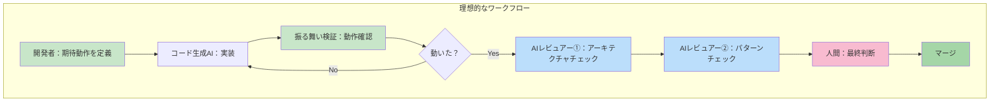

流れはこう：

1. **開発者**が期待動作を定義（振る舞いファースト）
2. **コード生成AI**が実装
3. **振る舞い検証**で動作確認（第一の品質保証）
4. 動いたら、**AIレビュアー**がチェック（第二の品質保証）
5. **人間**が最終判断（第三の品質保証）

**人間がやることは、最初と最後だけ。**

- 最初：「何を作るか」を定義
- 最後：「これでいいか」を判断

その間のコード生成、動作確認、アーキテクチャチェック、パターン検出は、すべて自動化。

**これが、AIコーディング時代の開発フローの究極形かもしれない。**

### 8.7 まだ見ぬ未来：AIレビュアーの進化

最後に、少し未来の話をしよう。

AIレビュアーは、これからもっと進化する。

**今（2025年）できること**
- アーキテクチャドキュメントに基づくチェック
- コードベース内のパターン検出
- 明らかな問題の指摘

**近い将来（1-2年後）できそうなこと**
- 過去のバグからの学習（「この書き方、以前バグになったよね」）
- パフォーマンステストの自動実行と最適化提案
- セキュリティ脆弱性の高度な検出

**もっと先（3-5年後）の可能性**
- ビジネスロジックの妥当性判断（要件定義と照合）
- コードレビューのレビュー（「人間のレビューコメント、的確？」）
- 自律的なリファクタリング提案と実行

**その時、開発者の役割は？**

コードを書く人ではなく、**システムを設計し、AIを統率する人**になっているかもしれない。

でも、それでいい。

なぜなら、**それこそが人間がやるべき、高度な仕事**だから。

---

## おまけの章、まとめ

AIがAIのコードをレビューする。

一見、SF的に聞こえるかもしれないが、技術的には今すぐ実現可能だ。

そして、これは「振る舞い検証ファースト」と組み合わせることで、さらに効果を発揮する。

```
振る舞い検証ファースト
  ↓
動作で品質を保証

AIレビュアー
  ↓  
アーキテクチャと一貫性を保証

人間
  ↓
ビジネス価値と最終判断を担当
```

**品質は下がらない。むしろ、上がる。**
**開発は遅くならない。むしろ、速くなる。**
**開発者のスキルは落ちない。むしろ、より高度になる。**

AIコーディング時代の開発は、こうあるべきだと思う。

もし、あなたのチームでAIレビュアーを導入してみたら、ぜひ教えてほしい。

一緒に、未来の開発スタイルを作っていこう。

---

## 補足：参考リンク

（必要に応じて追加）

- [スクラムガイド](https://scrumguides.org/index.html) - インクリメントの定義
- [テストピラミッド](https://martinfowler.com/articles/practical-test-pyramid.html) - Martin Fowler
- （その他、チームで使っているツール、フレームワークのドキュメント等）
