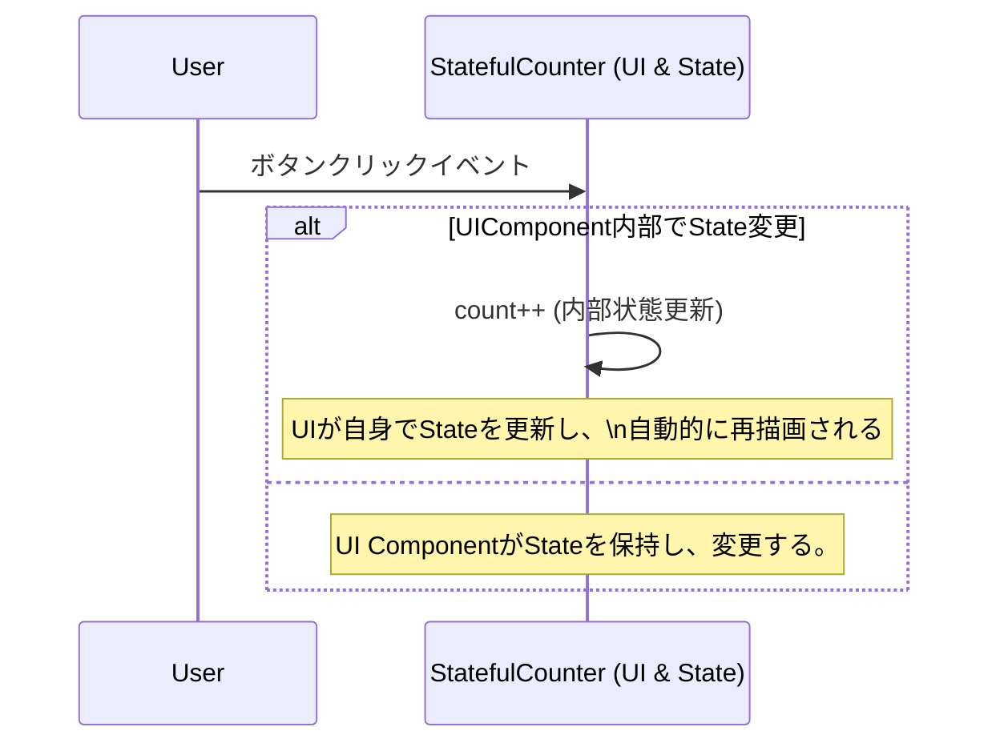
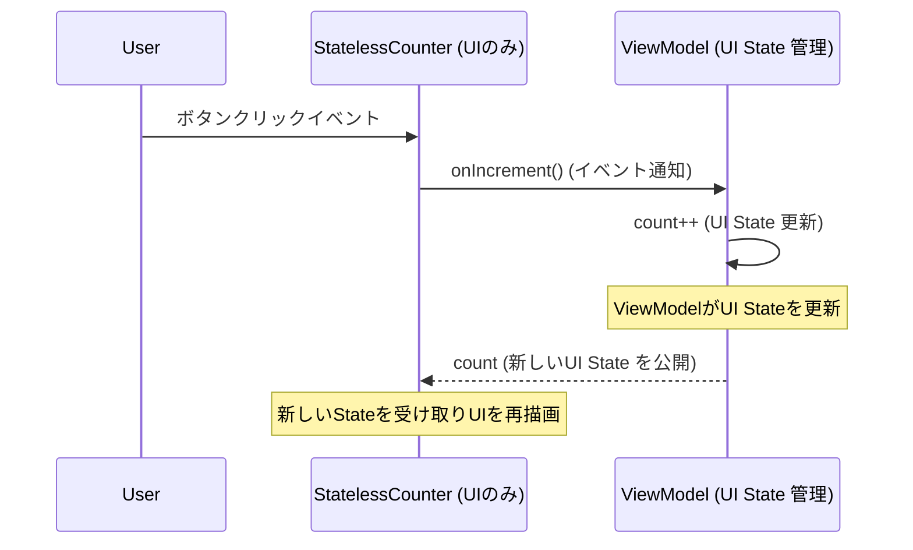

# テスタブルなアプリ開発のアーキテクチャ
## ステート駆動と宣言的UI

---

## 1. はじめに

### なぜ今、テスタブルなアプリ開発なのか？

- Jetpack Compose や SwiftUI など宣言的UIの普及
- モバイルアプリ開発の現場での変化

---

### テスタビリティの重要性

- バグの早期発見
- 変更への強さ
- 開発効率向上

---

### 現場でよくある疑問

- 「どうやってテストを書けばいいんだろう？」
- 「アーキテクチャはどう設計すればいいんだろう？」

---

## テスタブルなアプリ開発のメリット

1. **バグの早期発見**  
   テストでバグを早期発見し、修正コストを削減
2. **変更への強さ**  
   テストがあれば安心してコードを変更できる
3. **開発効率の向上**  
   手動テストの手間が減り、チーム全体の生産性が向上

---

## 2. 宣言的UIとは何か？

### 命令的UIと宣言的UIの違い

- 命令的UI：UIの手順を記述し手動で更新
- 宣言的UI：状態（あるべき姿）を宣言し、ステート変更で自動再描画

---

### 命令的UIの例

```pseudo
// 命令的UIの例
if (buttonClicked) {
    textView.setText("新しい値")
}
```

---

### 宣言的UIの例

```pseudo
// 宣言的UIの例
Text(text = if (buttonClicked) "新しい値" else "初期値")
```

---

### カウンターアプリの例（Kotlin/Compose）

```kotlin
@Composable
fun CounterScreen() {
    var count by remember { mutableStateOf(0) }
    Column {
        Text(text = "Count: $count")
        Button(onClick = { count++ }) {
            Text("Increment")
        }
    }
}
```

---

### 宣言的UIの本質

- UIは「ステート」によって自動的に再描画される
- 「UIをどう更新するか」ではなく「この状態ならUIはこうあるべき」を宣言

---

### 宣言的UIのメリット

- UIの状態管理がシンプル
- ステート変更で自動的にUIが更新
- コードの見通しが良くなる

---

## 3. テスタビリティを最大化する「ステートレスな宣言的UI」

### ステートフルUIとステートレスUI

- ステートフルUI：UIが状態を内部管理→テストが複雑
- ステートレスUI：状態は外部から受け取り、イベントは外部に通知、単方向データフローで責任分離

---

### ステートフルな宣言的UIの例

```kotlin
@Composable
fun StatefulCounter() {
    var count by remember { mutableStateOf(0) }
    Button(onClick = { count++ }) {
        Text("Count: $count")
    }
}
```

---

### ステートフルUIの課題

- UIコンポーネントが状態管理の責任まで持つ
- テストがUIテストに寄りがちで遅く不安定
- 柔軟性・再利用性が低下

---

### ステートレスな宣言的UIの例

```kotlin
@Composable
fun StatelessCounter(count: Int, onIncrement: () -> Unit) {
    Button(onClick = onIncrement) {
        Text("Count: $count")
    }
}
```

---

### ステートレスUIの利点

- UIは「表示」と「イベント通知」に徹する
- 状態は外部（ViewModel等）で管理
- テストが容易で高速

---

### シーケンス図で見る単方向データフロー

#### ステートフルなUI
<!-- mermaid -->


---

#### ステートレスなUI + UI State Holder
<!-- mermaid -->


---

### テストの容易性

- ステートレスUIは特定のステートを与えて描画テストができる
- ロジックはUIから独立してユニットテスト可能

---

## 4. アプリの「ドメインステート」とビジネスロジックの分離

### ドメインステートとは

- UIとは独立したアプリの本質的な状態
- 例：ログイン状態、商品リスト、カートの中身

---

### ドメインモデルの例

- 「商品の在庫数はマイナスにならない」
- 「ログインユーザーだけがカートに商品を追加できる」

---

### ドメイン駆動設計（DDD）

- ビジネスロジックをドメインモデルに集約
- UIとドメインロジックを分離

---

### ドメインステート分離のメリット

- UIから独立した純粋なロジックテストが可能
- UIテストは「このドメインステートならUIはこうあるべき」だけを確認

---

## 5. テスタビリティを損なう「副作用」の管理

### 副作用とは？

- ネットワーク通信、DBアクセス、ファイル操作、ログ出力、タイマーなど
- アプリが外部の状態を変化させる処理

---

### 宣言的UIの「副作用」の落とし穴

- UIの中に副作用を直接書くとテスト困難・再利用性低下・予期せぬ再実行

---

### 良くない例：副作用をUIに直接書く

```kotlin
@Composable
fun BadExampleScreen() {
    var count by remember { mutableStateOf(0) }
    Button(onClick = {
        count++
        // 🚨 良くない例：宣言的UIの中に直接ネットワーク通信！
        saveCountToServer(count)
    }) {
        Text("Increment and Save")
    }
}
```

---

### 副作用の理想的な管理

- UIはイベントをCallbackで通知するだけ
- 副作用はUIの外部（UseCase/Repository等）で管理
- UI層はビジネスロジックや外部依存から独立

---

### MVIパターンとの親和性

- UI→Intent→Model→Viewの単方向データフロー
- 副作用管理が明確

---

### 理想的な副作用管理の流れ

1. イベント発生（ユーザーのボタンタップなど）
2. UIがイベントをCallbackとして通知
3. ステート管理層がロジックを計算（副作用なし）
4. 必要ならUseCase/Repository層で副作用を実行
5. 副作用の結果をステートに反映し、UIを更新

---

## 6. まとめ

### 実践ポイント

- 宣言的UIとステート駆動の本質を理解
- ステートレスUIとドメイン分離でテスタビリティ向上
- 副作用の適切な管理が堅牢なアプリの鍵
- これらの実践で、堅牢で変更に強いアプリ開発を実現

---

# ご清聴ありがとうございました！ 