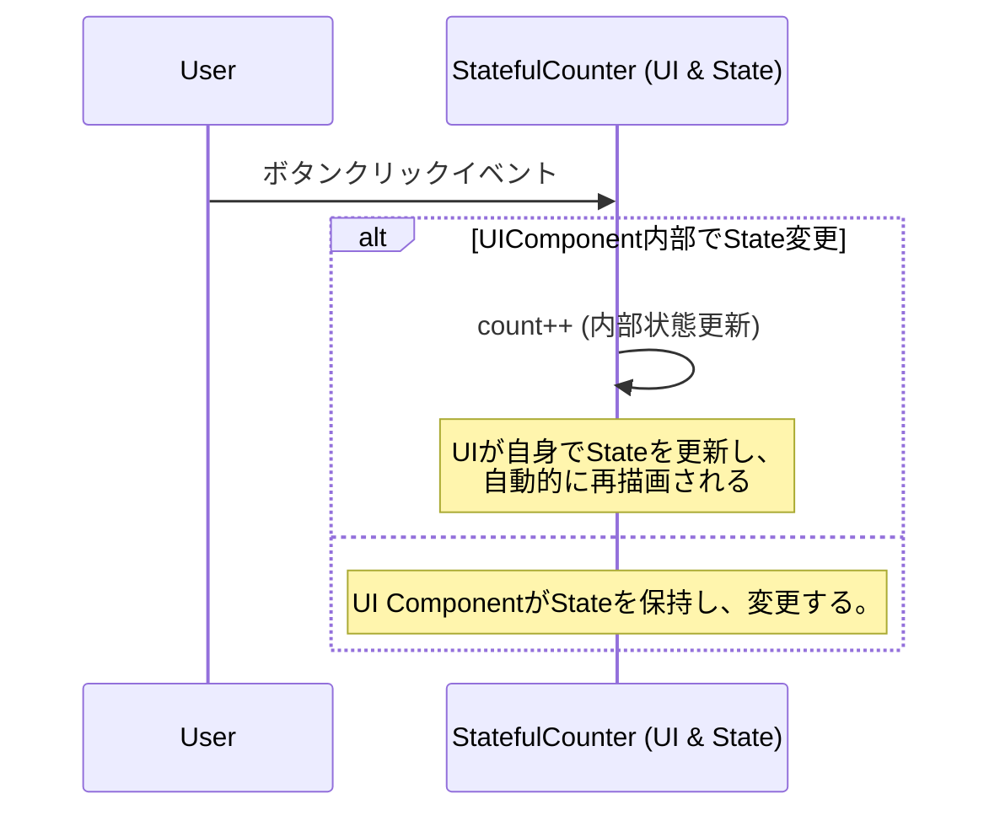
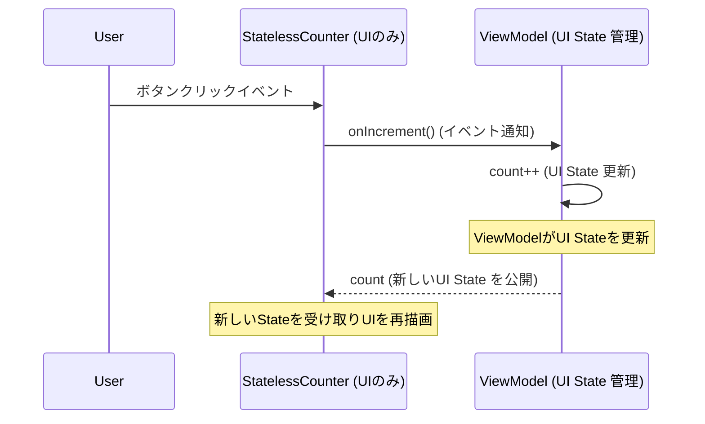

-----

はい、では次の節、「3. テスタビリティを最大化する『ステートレスな宣言的UI』」について、LT向けの原稿を作成します。ここは、シーケンス図を使った比較の説明が入る重要な部分ですね。

-----

# 3. テスタビリティを最大化する「ステートレスな宣言的UI」

さて、宣言的UIが「ステート」に駆動されることはご理解いただけたかと思います。では、そのステートをどのように扱うかで、**テスタビリティ**が大きく変わってきます。

宣言的UIにおいて、UIの「ステート」の管理方法には大きく分けて2つのアプローチがあります。

1. **ステートフルな宣言的UI**
2. **ステートレスな宣言的UI**

---

## ステートフルな宣言的UIの課題

まずは「**ステートフルな宣言的UI**」から見ていきましょう。

これは、UIコンポーネント自身が、その表示に必要な状態を**内部で管理する**形式です。先ほどのカウンターの例でいうと、`remember { mutableStateOf(0) }` のように、UIコンポーネント自身が`count`の値を保持し、変更していました。

```kotlin
@Composable
fun StatefulCounter() {
    var count by remember { mutableStateOf(0) } // UIコンポーネントがステートを内部管理
    Button(onClick = { count++ }) {
        Text("Count: $count")
    }
}
```

このアプローチは、非常にシンプルなUIでは手軽に書けます。しかし、UIコンポーネントが**状態管理の責任まで持ってしまっている**ため、柔軟性に欠けたり、特に**テストが複雑になったりする**傾向があります。UIコンポーネントの内部状態に依存してしまうため、UIを実際に動かして操作しないとテストしづらく、**高速なユニットテストが難しい**という課題があります。

---

## ステートレスな宣言的UIの利点

そこで推奨したいのが、「**ステートレスな宣言的UI**」です。

こちらは、UIコンポーネント自身は状態を**一切管理しません**。表示に必要なすべての**ステートを外部から引数として受け取り**、そして、UIコンポーネント内で発生したイベント（ボタンクリックなど）は、**外部にコールバックとして通知する**だけです。

```kotlin
@Composable
fun StatelessCounter(count: Int, onIncrement: () -> Unit) { // ステートを外部から受け取る
    Button(onClick = onIncrement) { // イベントを外部に通知
        Text("Count: $count")
    }
}
```

このアプローチでは、UIコンポーネントは「**与えられたステートを表示し、発生したイベントを通知する**」という**純粋な役割**に徹します。まさに「**純粋な表示器**」です。

---

## シーケンス図で見る単方向データフロー

このステートレスなアプローチが、なぜテスタビリティを最大化するのか？それを「**単方向データフロー**」のシーケンス図で比較して見てみましょう。

### ステートフルな宣言的UIのシーケンス図



ユーザーがボタンをクリックすると、**UIコンポーネント自身が内部でステートを更新**し、UIが再描画されます。この図を見ると、一見シンプルに見えるかもしれません。しかし、これはUIコンポーネントが**ユーザーイベントのハンドリング**と、それに伴う**自身の内部状態の更新**という複数の責任を同時に持っていることを意味します。この「責任の凝集」が、テストや再利用性の低さにつながる落とし穴なんです。

---

### ステートレスな宣言的UI + UI State Holderのシーケンス図

次に、**ステートレスなUI**と、その**ステートを管理するUI State Holder**（例えばViewModel）を組み合わせた場合です。



ユーザーがボタンをクリックすると、**UIコンポーネント**は、そのイベントを**UI State HolderであるViewModelに「通知」するだけ**です。ViewModelがその通知を受け取り、UIの**ステートを更新**します。そして、更新されたステートは**一方通行**で再びUIコンポーネントに渡され、UIが再描画されます。

この図からわかるように、**UIコンポーネント**はユーザーイベントを通知し、渡されたステートを表示するという**純粋な役割**に徹しています。そして、UIの表示に必要な**ステートの管理と更新は、UI State Holderが責任を持つ**という、明確な役割分担ができています。

---

## テストの容易性

この分離こそが、テスタビリティを劇的に向上させます。

- **UIのテスト**：ステートレスなUIコンポーネントは、**特定のステートを与えれば、期待通りのUIが表示されるか**、というテストが非常に簡単に行えます。これはUIの描画のみをテストするため、高速で信頼性が高いテストが可能です。
- **ロジックのテスト**：そして、UI State HolderはUIから完全に独立しているため、UIコンポーネントがどう表示されるかを気にせず、**イベントを受けてステートがどう変わるか**、という純粋なロジックをテストできます。これも高速で安定したユニットテストが可能です。

ステートフルなUIは手軽に見えますが、複雑なアプリではすぐにテストやメンテナンスのボトルネックになります。ステートレスな宣言的UIを採用し、UIのステート管理を明確に分離することで、私たちはテスタビリティという大きなメリットを得られるのです。

---
